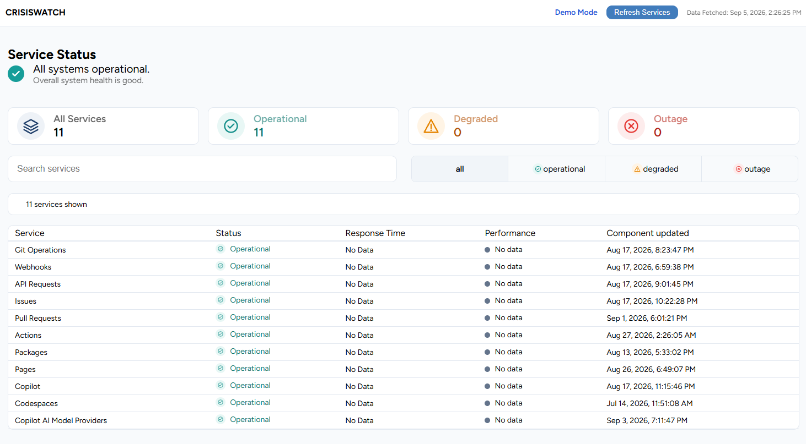

# CrisisWatch

CrisisWatch is a responsive service-status dashboard built with vanilla JavaScript.

It loads live component-status data from the [GitHub Status API](https://www.githubstatus.com/api/v2/summary.json) with the Fetch API, normalises the API response to an internal data model, validates it before rendering, and presents the resulting system state through summary cards and a searchable, filterable service table.

## Live Demo

[Open CrisisWatch](https://rr-cod3s.github.io/CrisisWatch/)

## Preview



## Project Status

Version 1 is deployed on GitHub Pages and loads live data from the GitHub Status API. `data/services.json` remains as a local fixture and is not fetched by the live application.

## Features

- Loads live component-status data with `fetch()` and `async` / `await`
- Checks HTTP responses with `response.ok`
- Validates the data shape before rendering
- Handles loading, error, empty, and retry states
- Calculates total, operational, degraded, and outage service counts
- Displays a derived overall system-health message
- Shows the latest component-update timestamp supplied by the API with `Intl.DateTimeFormat`
- Searches services by name
- Combines search and status filters without changing the original data
- Categorises available response times as Fast, Moderate, Slow, Unavailable, or No data
- Uses semantic form controls, visible focus styles, live regions, and reduced-motion support
- Keeps the service table horizontally scrollable and keyboard-focusable on narrow screens

## Data Model and Validation

The GitHub API response is normalised before the rest of the application uses it:

```text
GitHub API component → mapGitHubComponent() → CrisisWatch service → validation → rendering
```

Each normalised service follows this structure:

```json
{
  "id": "8l4ygp009s5s",
  "name": "Git Operations",
  "status": "operational",
  "responseTime": null,
  "lastChecked": "2026-08-17T18:23:47.907Z"
}
```

GitHub status values are mapped to the internal values `operational`, `degraded`, and `outage`. `degraded_performance`, `partial_outage`, and `under_maintenance` become `degraded`; `major_outage` becomes `outage`.

The endpoint does not provide response-time measurements, so `responseTime` is `null` and the interface displays “No data”. `lastChecked` is derived from GitHub's `updated_at` value and represents the latest component update, not an independent health check.

Before rendering, the application checks that `apiData.components` is an array. It then validates the normalised services: names cannot be empty, statuses must be known, response times must be a valid number or `null`, timestamps must be parseable, and service IDs must be unique. Invalid data reaches the error state instead of being partially rendered.

## Architecture

```text
CrisisWatch/
├── css/
│   └── styles.css
├── data/
│   └── services.json   # Local fixture; not fetched by the live application
├── fonts/
│   └── Figtree-VariableFont_wght.ttf
├── images/
├── js/
│   ├── api.js       # Fetching, normalisation, and data validation
│   ├── app.js       # Application state and orchestration
│   ├── filters.js   # Search and status-filter logic
│   └── render.js    # DOM rendering and UI states
├── index.html
└── README.md
```

`api.js` is responsible for loading and validating data. `filters.js` returns a new filtered array from the search term and selected status. `render.js` owns the visible UI states and rendered service table, while `app.js` coordinates state and user events.

## Technologies

- HTML
- CSS
- Vanilla JavaScript
- ES Modules
- Fetch API
- Git and GitHub

No dependencies or build step are required.

## Run Locally

1. Clone the repository:

   ```bash
   git clone https://github.com/rr-cod3s/CrisisWatch.git
   ```

2. Open the project folder in an editor.

3. Serve the project with any local development server, such as the Live Server extension in VS Code.

The project uses ES modules and `fetch()`, so opening `index.html` directly from the file system can prevent the application and live data from loading.

## What I Learned

- How `fetch()`, Promises, and `await` work together
- Why HTTP errors require `response.ok` in addition to `try` / `catch`
- How to normalise external API data while keeping data loading, filtering, and DOM rendering separate
- How to combine multiple filters without mutating original data
- How to design loading, error, empty, and retry states
- How small accessibility decisions improve everyday UI behaviour

## Technical Challenge

The main challenge was applying search and status filtering together while preserving the original service data for the overview cards and subsequent filter changes.

The solution is the central `filterServices()` function. It receives the source array, the search term, and the selected status, then returns a new array for rendering.

## Future Improvements

- Add automated tests for filtering and data validation
- Add automatic refreshes and request cancellation
- Add sorting by response time and status
- Add service detail views and incident history
